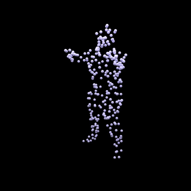
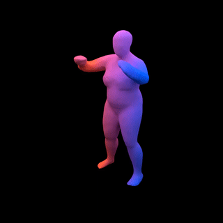

# LPDC-Net
[Homepage](https://tangjiapeng.github.io/LPDC-Net) | [Paper-Pdf](https://arxiv.org/pdf/2103.16341.pdf)

This repository contains the code for the project **LPDC-Net - Learning Parallel Dense Correspondence from Spatio-Temporal Descriptors
for Efficient and Robust 4D Reconstruction** 

You can find detailed usage instructions for training your own models and using the [pretrained models](https://drive.google.com/drive/folders/1jPrkxd9GYKtSsQt_q4poIYMuxeXlYRZ9?usp=sharing).

## Installation
First you have to make sure that you have all dependencies in place.  You can create and activate an anaconda environment called `lpdc` using

```
conda env create -f environment.yaml
conda activate lpdc
```
Next, compile the extension modules. You can do this via
```
python setup.py build_ext --inplace
```

## Demo

You can test our code on the provided input point cloud sequences in the `demo/` folder. To this end, simple run
```
python generate.py configs/demo.yaml
```
This script should create a folder `out/demo/` where the output is stored.

## Dataset

### Point-based Data
To train a new model from scratch, you have to download the full dataset.
You can download the pre-processed data (~42 GB) using

```
bash scripts/download_data.sh
```

The script will download the point-based point-based data for the [Dynamic FAUST (D-FAUST)](http://dfaust.is.tue.mpg.de/) dataset to the `data/` folder. 

### Mesh Data

Please follow the instructions on [D-FAUST homepage](http://dfaust.is.tue.mpg.de/) to download the "female and male registrations" as well as "scripts to load / parse the data".
Next, follow their instructions in the `scripts/README.txt` file to extract the obj-files of the sequences. Once completed, you should have a folder with the following structure:   
___
your_dfaust_folder/  
| 50002_chicken_wings/  
&nbsp;&nbsp;&nbsp;&nbsp;| 00000.obj  
&nbsp;&nbsp;&nbsp;&nbsp;| 00001.obj  
&nbsp;&nbsp;&nbsp;&nbsp;| ...  
&nbsp;&nbsp;&nbsp;&nbsp;| 000215.obj  
| 50002_hips/  
&nbsp;&nbsp;&nbsp;&nbsp;| 00000.obj  
&nbsp;&nbsp;&nbsp;&nbsp;| ...  
| ...  
| 50027_shake_shoulders/  
&nbsp;&nbsp;&nbsp;&nbsp;| 00000.obj  
&nbsp;&nbsp;&nbsp;&nbsp;| ...  
___
You can now run
```
bash scripts/migrate_dfaust.sh path/to/your_dfaust_folder
```
to copy the mesh data to the dataset folder. 
The argument has to be the folder to which you have extracted the mesh data (the `your_dfaust_folder` from the directory tree above).

### Incomplete Point Cloud Sequence 

You can now run
```
bash scripts/build_dataset_incomplete.sh
```
to create incomplete point cloud sequences for the experiment of 4D Shape Completion. 

## Usage

When you have installed all dependencies and obtained the preprocessed data, you are ready to run our pre-trained models and train new models from scratch.

### Generation

<div style="text-align: center">


</div>

To start the normal mesh generation process using a trained model, use

```
python generate.py configs/CONFIG.yaml
```
where you replace `CONFIG.yaml` with the name of the configuration file you want to use.

The easiest way is to use a pretrained model. You can do this by using one of the config files

```
configs/noflow/lpdc_even_pretrained.yaml
configs/noflow/lpdc_uneven_pretrained.yaml
configs/noflow/lpdc_completion_pretrained.yaml
```

Our script will automatically download the model checkpoints and run the generation. 
You can find the outputs in the `out/pointcloud` folder.

Please note that the config files *_pretrained.yaml are only for generation, not for training new models: when these configs are used for training, the model
will be trained from scratch, but during inference our code will still use the pretrained model.

### Evaluation

You can evaluate the generated output of a model on the test set using

```
python eval.py configs/CONFIG.yaml
```
The evaluation results will be saved to pickle and csv files.

### Training

Finally, to train a new network from scratch, run
```
python train.py configs/CONFIG.yaml
```
You can monitor the training process on http://localhost:6006 using tensorboard:
```
cd OUTPUT_DIR
tensorboard --logdir ./logs --port 6006
```
where you replace `OUTPUT_DIR` with the respective output directory. For available training options, please have a look at `config/default.yaml`. 


## Acknowledgements

Most of the code is borrowed from [Occupancy Flow](https://github.com/autonomousvision/occupancy_flow). We thank Michael Niemeyer for his great works and repos.

## Citation

If you find our code or paper useful, please consider citing

    @article{tang2021learning,
      title={Learning Parallel Dense Correspondence from Spatio-Temporal Descriptors for Efficient and Robust 4D Reconstruction},
      author={Tang, Jiapeng and Xu, Dan and Jia, Kui and Zhang, Lei},
      journal={arXiv preprint arXiv:2103.16341},
      year={2021}
    }